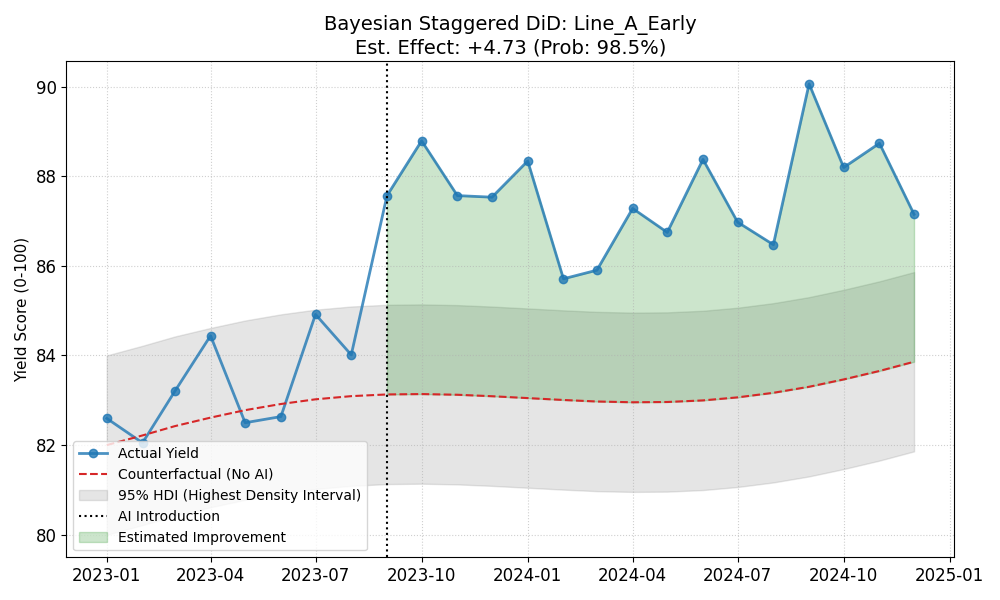

# bayesian_staggered_did_thermometer
Analyzes "AI Thermometer" yield impact using Bayesian Staggered DiD (MCMC). Handles varied adoption timings and outputs improvement probabilities. ベイズ流Staggered DiDによるAI温度計の歩留まり検証ツール。導入時期のバラつきに対応し、MCMCで改善確率や信用区間を算出します。

# Bayesian Staggered DiD for AI Thermometer Analysis 🌡️
**Evaluating Manufacturing Yield with Time-Varying Treatments using Bayesian Gaussian Models.**

> 🇯🇵 **[Click here for Japanese Description / 日本語の説明はこちら](#-japanese-description)**

## 📖 Overview
This project simulates and analyzes the causal impact of an **"AI Thermometer"** introduction on manufacturing yield across multiple production lines.

Unlike traditional A/B tests or simple Difference-in-Differences (DiD), this tool is designed for **Staggered Adoption** scenarios, where different lines introduce the technology at different times. By utilizing **Bayesian Inference (Bayesian OLS)**, it estimates the treatment effect with probabilistic uncertainty, providing **95% HDI (Highest Density Intervals)** and the **Probability of Improvement** for robust decision-making.

## 🚀 Key Features
* **Staggered Design Support**: Handles complex timelines with Early Adopters, Late Adopters, and Control groups.
* **Bayesian Gaussian Modeling**: Uses MCMC sampling (`Bambi` & `PyMC`) to estimate continuous yield outcomes.
* **Probabilistic Insights**: Outputs "Probability of Positive Effect" and **95% HDI** rather than point estimates or p-values.
* **Counterfactual Visualization**: Plots the actual yield against the predicted "what-if" scenario (if AI were never introduced).

## 📷 Analysis Result

*(Actual Yield vs Counterfactual Prediction with 95% HDI)*

## 📊 Methodology
The model estimates the causal impact ($\delta$) while controlling for common time trends and line-specific baselines:

$$Yield_{it} \sim \mathcal{N}(\mu_{it}, \sigma)$$
$$\mu_{it} = \alpha + \beta_{Time}(\text{Time}_{t}) + \beta_{Line}(\text{Line}_{i}) + \delta(\text{Intervention}_{it})$$

* $Yield_{it}$: Yield score (0-100) of line $i$ at time $t$.
* $\text{Intervention}_{it}$: Binary indicator (1 if AI is active, 0 otherwise).
* $\delta$: **The Causal Estimator** (Impact of the AI Thermometer).

## 📂 File Structure
| File | Description |
| :--- | :--- |
| `staggered_data_generator.py` | **Data Generator**: Creates dummy yield data for multiple lines. |
| `bayesian_staggered_analyzer.py` | **Analysis Tool**: A GUI application to load data, run MCMC, and visualize results. |

## 🛠️ Usage
### 1. Generate Data
```bash
python staggered_data_generator.py
````

### 2\. Run Analysis

```bash
python bayesian_staggered_analyzer.py
```

Select the generated Excel file and click **"Run Bayesian Analysis"**.

## 📦 Requirements

  * Python 3.10+
  * `bambi`, `pymc`, `arviz`, `pandas`, `matplotlib`, `tkinter`

<!-- end list -->

```bash
pip install bambi pymc arviz pandas matplotlib
```

## 👤 Author

**Go Sato (Data Scientist)**

  * Specializing in Causal Inference and Bayesian Statistics for manufacturing process optimization.

-----

<br>

# 🇯🇵 Japanese Description

## 📖 概要

本プロジェクトは、製造ラインへの\*\*「AI温度計」\*\*導入が歩留まり（Yield）に与える因果効果を検証するシミュレーションおよび分析ツールです。

ラインごとに導入時期が異なる\*\*「Staggered（時間差）導入」\*\*のシナリオに対応しています。\*\*ベイズ推論（Bayesian OLS）**を用いることで、単なる点推定ではなく、**「95% HDI（最高密度区間）」\*\*や「改善の確信度（確率）」を算出し、不確実性を考慮した高度な意思決定を支援します。

## 🚀 主な特徴

  * **Staggered導入への対応**: 早期導入、後期導入、未導入（Control）が混在する複雑なタイムラインを処理します。
  * **ベイズ流ガウス回帰**: MCMCサンプリング（`Bambi` & `PyMC`）を用い、連続値の歩留まりを推定します。
  * **確率的な示唆**: \*\*95% HDI（最高密度区間）\*\*を用いて、パラメータの不確実性を定量化します。
  * **反実仮想（Counterfactual）の可視化**: 「もしAIを導入していなかったら」という予測線を描画し、効果を可視化します。

## 📊 分析手法

モデルは、共通の時間トレンドとラインごとのベースラインを制御しつつ、介入効果（$\delta$）を推定します。

$$Yield_{it} \sim \mathcal{N}(\mu_{it}, \sigma)$$
$$\mu_{it} = \alpha + \beta_{Time}(\text{Time}_{t}) + \beta_{Line}(\text{Line}_{i}) + \delta(\text{Intervention}_{it})$$

## 📂 ファイル構成

| ファイル名 | 説明 |
| :--- | :--- |
| `staggered_data_generator.py` | **データ生成**: ダミー歩留まりデータを生成します。 |
| `bayesian_staggered_analyzer.py` | **分析ツール**: データの読み込み、MCMC実行、可視化を行うGUIアプリです。 |

## 🛠️ 使用方法

1.  `python staggered_data_generator.py` でデータを生成。
2.  `python bayesian_staggered_analyzer.py` を起動し、ファイルを選択して実行。

## 📦 必要ライブラリ

`bambi`, `pymc`, `arviz`, `pandas`, `matplotlib`

## 👤 著者

**Go Sato (Data Scientist)**

  * 製造プロセスの最適化における因果推論とベイズ統計解析を専門としています。
